# Jarkom-Modul-2-2026-K-14
|No|Nama Anggota|NRP|
|---|---|---|
|1|Muhammad Satrio Utomo|5027251022|
|2|Sebastian Elroi Hasian Panjaitan|5027251040|

## Pengerjaan

### Soal 1 - Satrio
> Sebagai pusat kesadaran The Mesh, rootkit harus merentangkan koneksinya ke lima gerbang utama (Switch). Tetapkan alamat IP dan default gateway untuk seluruh Entitas, mulai dari para operator (alpha, beta, gamma), penjaga directory (prab, tedd), gerbang penyaring (abbey, penny), hingga repository (obladi, desmond, oblada, molly) sesuai dengan topologi pembagian switch yang dirancang. [GUNAKAN PREFIX IP MASING-MASING KELOMPOK].

Membuat topologi dengan Rootkit sebagai root, menambahkan 5 switch (switch 2 & 3 gabung dengan switch 1), dan 13 Node yang meyambung ke switch masing-masing. <br>
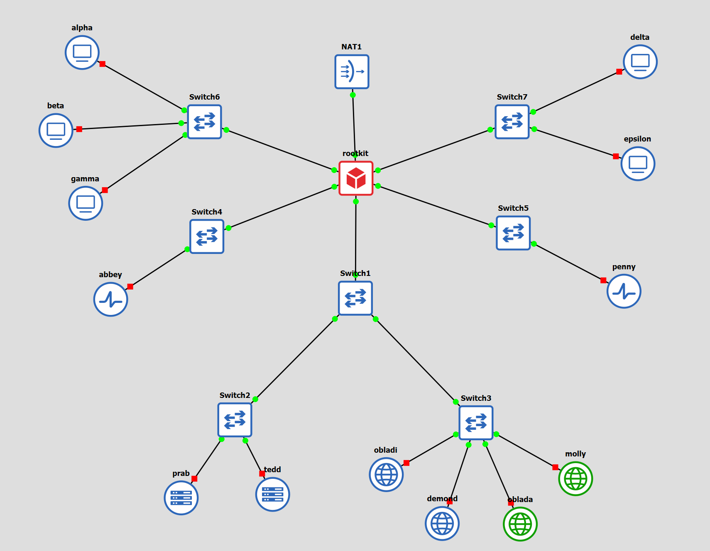 <br>

Pembuktian jika Node sudah tersambung ke routernya, dengan melakukan ping alamat IP dari node tersebut.
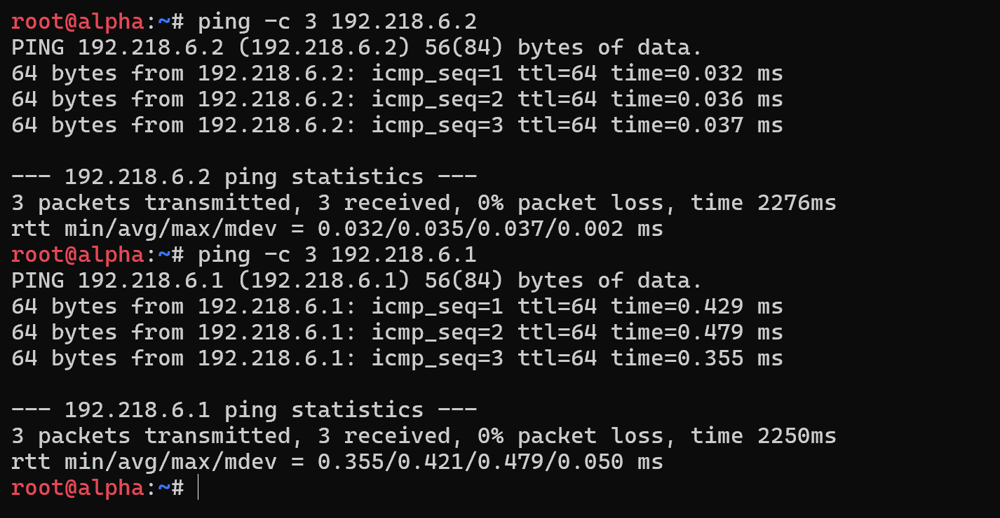

### Soal 2 - Satrio
> Meskipun The Mesh beroperasi dalam bayang-bayang, Rootkit menyadari bahwa Entitas di dalamnya masih membutuhkan asupan paket dari dunia luar. Buka jalur menuju NAT dengan memastikan antarmuka WAN di router rootkit aktif. Konfigurasikan NAT agar dapat meneruskan lalu lintas keluar bagi seluruh alamat internal, sehingga semua host di dalam jaringan dapat menjangkau internet publik menggunakan IP address

Menambahkan script pada node Rootkit agar terhubung ke internet, saya masukkan ke dalam file `script.sh`:

```
#!/bin/bash

sysctl -w net.ipv4.ip_forward=1

iptables -t nat -A POSTROUTING -o eth0 -j MASQUERADE
```
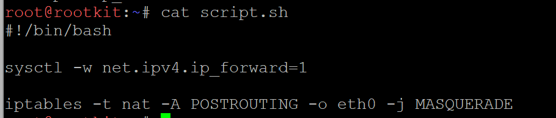

Pembuktian sudah terhubung ke internet bisa diakukan dengan melakukan `ping 8.8.8.8` pada salah satu Node, contohnya pada node `alpha`:
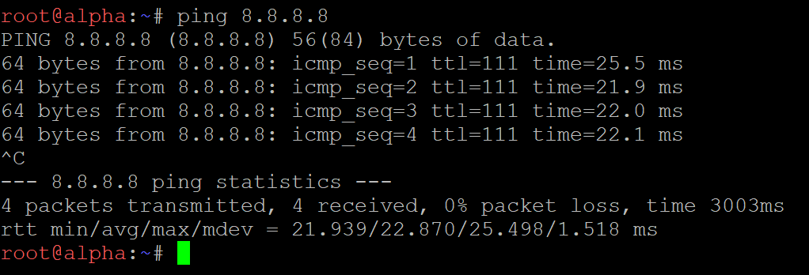

### Soal 3 - Satrio
>Jaringan rahasia tidak akan berfungsi tanpa sinkronisasi antar divisi. Pastikan seluruh Entitas dapat saling terhubung dan berkomunikasi lintas jalur (routing internal via rootkit berfungsi). Untuk menghindari fragmentasi saat persiapan, pastikan setiap host non-router menambahkan resolver 192.168.122.1 (tambah di file /etc/resolv.conf, kalau sudah pakai resolver itu tidak perlu memasukkan resolver google) saat antarmukanya aktif agar akses untuk mengunduh paket instalasi dari internet tersedia sejak awal beroperasi.

Konfigurasi untuk soal ini sebagian besar sudah diselesaikan berbarengan dengan Soal 1. Penambahan resolver `192.168.122.1` sudah diotomatisasi melalui opsi *Network Configuration* di GNS3 menggunakan parameter `up echo "nameserver 192.168.122.1" > /etc/resolv.conf`. Selain itu, karena seluruh node non-router telah dikonfigurasi *default gateway*-nya menuju `rootkit`, *routing* internal antar-divisi otomatis terbentuk.

Pembuktian bahwa *resolver* telah terpasang dan berfungsi untuk menjangkau domain luar (internet):
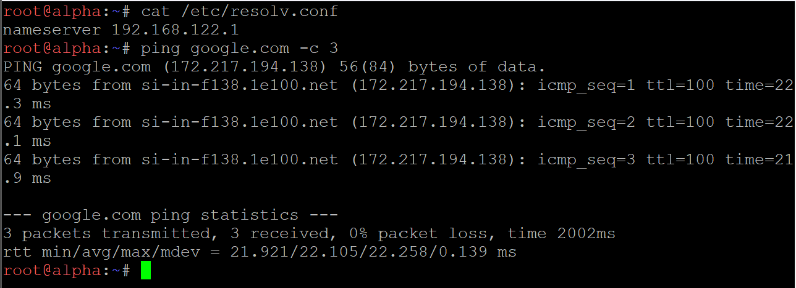

Pembuktian bahwa komunikasi lintas jalur/subnet berjalan normal (internal routing):
- Ping node dalam subnet yang sama (node beta)
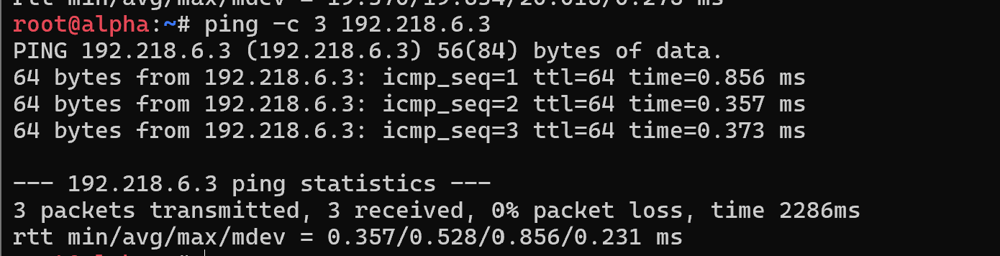
- Ping node dalam subnet yang berbeda (node delta)
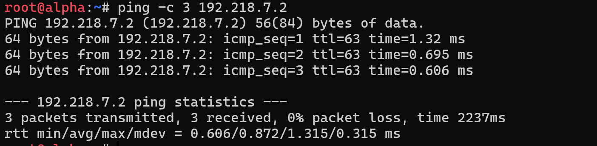

### Soal 4 - Satrio
> Penjaga Direktori mulai menuliskan hukum The Mesh. Pada node prab, bangun zona `xxxx>.com` sebagai authoritative dengan SOA yang menunjuk ke `prab.<xxxx>.com`, serta tambahkan catatan NS untuk `prab.<xxxx>.com` dan `tedd.<xxxx>.com`. Buat A record untuk `prab.<xxxx>.com` dan `tedd.<xxxx>.com` yang mengarah ke alamat IP mereka masing-masing, serta A record apex `<xxxx>.com` yang mengarah ke gerbang aplikasi dinamis (penny). Aktifkan fitur notify dan allow-transfer ke tedd, lalu set forwarders ke `192.168.122.1`. Di node tedd, tarik zona `<xxxx>.com` dari master dan pastikan server menjawab secara authoritative. Setelah fondasi nama ini berdiri kokoh, perbarui urutan resolver pada seluruh Entitas non-router menjadi: IP prab, IP tedd, lalu `192.168.122.1`. Verifikasi bahwa query ke domain apex maupun hostname di dalam zona dijawab dengan benar oleh prab atau tedd. 

Penyelesaian soal ini dibagi menjadi 3 tahap: konfigurasi DNS Master pada `prab`, konfigurasi DNS Slave pada `tedd`, dan pembaruan urutan *resolver* di seluruh *node* *non-router*. Nama domain yang digunakan adalah `k14.com`.

**1. Konfigurasi DNS Master (Node prab)**
Pada node `prab`, saya membuat *script* instalasi `bind9`, menambahkan *forwarders* ke `192.168.122.1`, mengatur zona `k14.com` dengan izin transfer ke `tedd` (IP 192.218.1.3), serta membuat *file* zona yang berisi SOA, NS, dan A record sesuai ketentuan soal. A record apex diarahkan ke IP node `penny` (192.218.5.2).

Isi dari `/root/dns-master.sh` pada node `prab`:
```bash
#!/bin/bash
apt-get update
apt-get install bind9 bind9utils bind9-doc dnsutils -y

# Mengatur forwarders
cat <<EOF> /etc/bind/named.conf.options
options {
        directory "/var/cache/bind";
        forwarders {
                192.168.122.1;
        };
        allow-query { any; };
        dnssec-validation auto;
        listen-on-v6 { any; };
};
EOF

# Deklarasi zona master dan izin transfer ke node tedd
cat <<EOF> /etc/bind/named.conf.local
zone "k14.com" {
    type master;
    file "/etc/bind/db.k14";
    allow-transfer { 192.218.1.3; };
    also-notify { 192.218.1.3; };
};
EOF

# Membuat file zona
cat <<EOF> /etc/bind/db.k14
\$TTL    604800
@       IN      SOA     prab.k14.com. root.k14.com. (
                              2026100101 ; Serial
                              604800     ; Refresh
                              86400      ; Retry
                              2419200    ; Expire
                              604800 )   ; Negative Cache TTL
;
@       IN      NS      prab.k14.com.
@       IN      NS      tedd.k14.com.
@       IN      A       192.218.5.2
prab    IN      A       192.218.1.2
tedd    IN      A       192.218.1.3
EOF

service bind9 restart
```
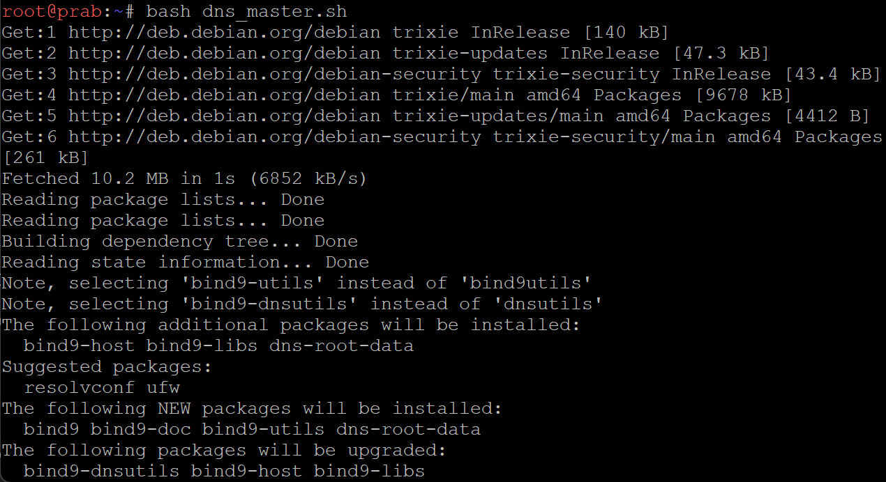

**2. Konfigurasi DNS Slave (Node tedd)**
Pada node `tedd`, saya mengonfigurasi `bind9` sebagai *slave* yang akan menarik data zona `k14.com` dari *master* `prab` (IP 192.218.1.2)

Isi dari `/root/dns-slave.sh` pada node `tedd`
```bash
#!/bin/bash
apt-get update
apt-get install bind9 bind9utils bind9-doc dnsutils -y

# Mengatur forwarders
cat <<EOF> /etc/bind/named.conf.options
options {
        directory "/var/cache/bind";
        forwarders {
                192.168.122.1;
        };
        allow-query { any; };
        dnssec-validation auto;
        listen-on-v6 { any; };
};
EOF

# Deklarasi zona slave
cat <<EOF> /etc/bind/named.conf.local
zone "k14.com" {
    type slave;
    masters { 192.218.1.2; };
    file "/var/cache/bind/db.k14";
};
EOF

service bind9 restart
```
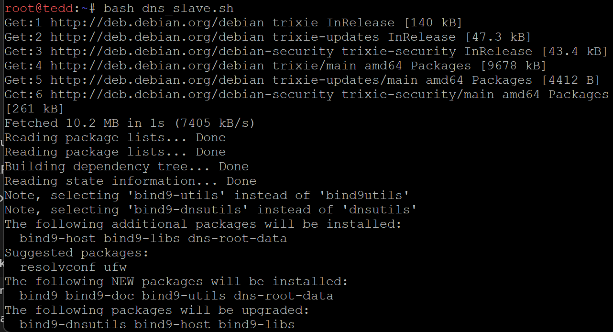

**3. Pembaruan resolver dan verifikasi**
Pada seluruh node non-router (contoh: `alpha`), saya memperbarui urutan resolver sesuai ketentuan soal melalui script berikut:

Isi dari `/root/resolv.sh` pada node klien (`alpha`):
``` bash
#!/bin/bash
cat <<EOF> /etc/resolv.conf
nameserver 192.218.1.2
nameserver 192.218.1.3
nameserver 192.168.122.1
EOF
```

Pembuktian bahwa urutan resolver sudah diperbarui sesuai instruksi:
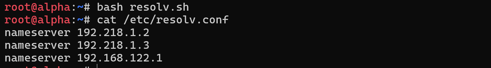

Pembuktian bahwa query ke domain apex (`k14.com`) diarahkan ke IP `penny` (`192.218.5.2`) dan dijawab secara authoritative oleh DNS server internal:
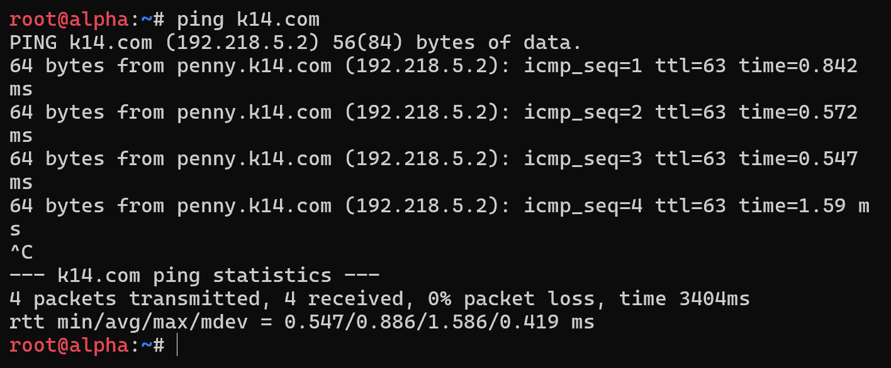

Pembuktian bahwa query ke hostname di dalam zona (misalnya `prab.k14.com` dan `tedd.k14.com`) dijawab dengan benar dengan IP yang sesuai:
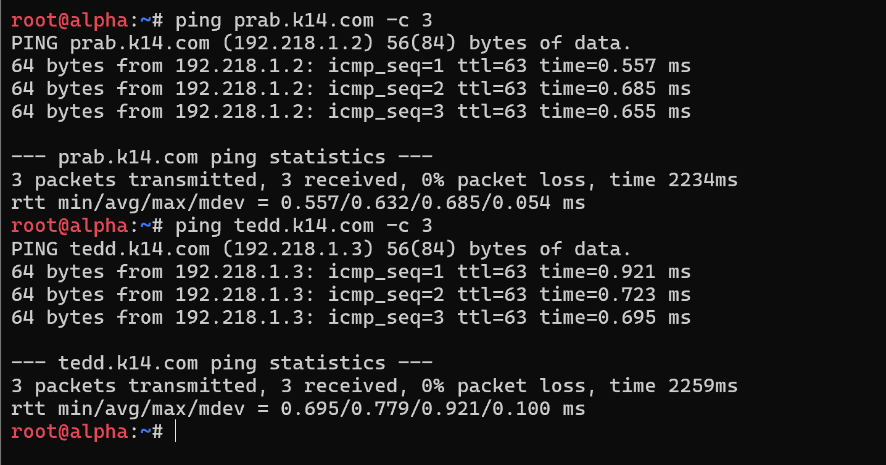

### Soal 5 - Satrio
>"Entitas tanpa identitas adalah anomali," pesan Rootkit. Namai semua Entitas (hostname) sesuai glosarium: rootkit, alpha, beta, gamma, delta, epsilon, prab, tedd, abbey, penny, obladi, desmond, oblada, molly, dan verifikasi bahwa setiap host mengenali hostname tersebut secara system-wide. Buat setiap domain untuk masing-masing node sesuai dengan namanya (contoh: `alpha.<xxxx>.com`) dan assign IP masing-masing juga. Lakukan pengecualian untuk node yang bertanggung jawab atas prab dan tedd.

Penyelesaian soal ini dibagi menjadi dua tahap, yaitu pengaturan identitas lokal pada setiap node dan pendaftaran nama domain (A record) di DNS Server.

**1. Konfigurasi Hostname System-Wide**
Pada setiap node, saya menetapkan *hostname* sesuai glosarium dan menambahkannya ke file `/etc/hosts` agar node tersebut mengenali identitasnya sendiri secara lokal.
Contoh isi `/root/script.sh` pada node `alpha`:
```bash
#!/bin/bash
hostname alpha
echo "192.218.6.2 alpha" >> /etc/hosts
```
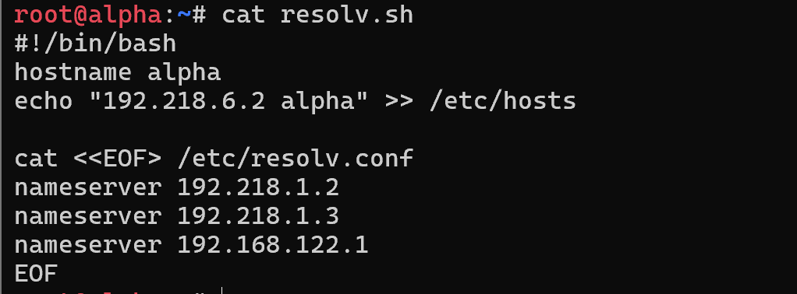

**2. Pendaftaran Domain di DNS Master (Node prab)**
Saya memperbarui file zona `db.k14` di node `prab` dengan menambahkan A record untuk semua node yang ada pada jaringan The Mesh. Node `prab` dan `tedd` dikecualikan dari pembuatan record baru karena sudah dideklarasikan pada pengerjaan nomor sebelumnya. Serial SOA dinaikkan menjadi `2026100102` agar node DNS Slave (`tedd`) melakukan sinkronisasi otomatis

Isi pembaruan `/etc/bind/db.k14` pada script.sh node `prab`:
```bash
cat <<EOF> /etc/bind/db.k14
\$TTL    604800
@       IN      SOA     prab.k14.com. root.k14.com. (
                              2026100102 ; Serial
                              604800     ; Refresh
                              86400      ; Retry
                              2419200    ; Expire
                              604800 )   ; Negative Cache TTL
;
@       IN      NS      prab.k14.com.
@       IN      NS      tedd.k14.com.
@       IN      A       192.218.5.2

; Pengecualian prab dan tedd
prab    IN      A       192.218.1.2
tedd    IN      A       192.218.1.3

; Node Lainnya
rootkit IN      A       192.218.1.1
alpha   IN      A       192.218.6.2
beta    IN      A       192.218.6.3
gamma   IN      A       192.218.6.4
delta   IN      A       192.218.7.2
epsilon IN      A       192.218.7.3
abbey   IN      A       192.218.4.2
penny   IN      A       192.218.5.2
obladi  IN      A       192.218.1.4
desmond IN      A       192.218.1.5
oblada  IN      A       192.218.1.6
molly   IN      A       192.218.1.7
EOF

pkill named && named
```

Pembuktian bahwa hostname telah dikenali secara system-wide di lokal node dan domain masing-masing node berhasil di-resolve oleh DNS:
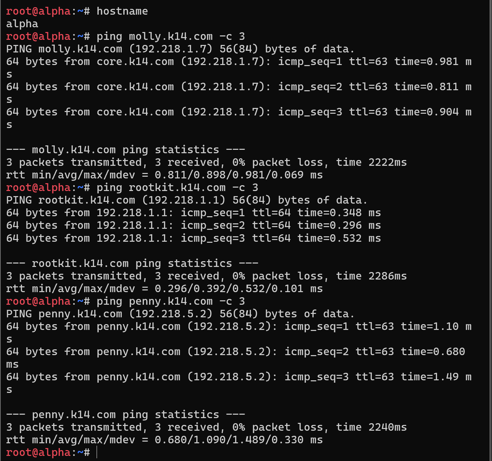

### Soal 6 - Satrio 
> Pastikan zone transfer berjalan, pastikan tedd telah menerima salinan zona terbaru dari prab. Nilai serial SOA di keduanya harus sama karena keduanya tidak bisa dipisahkan dan saling melengkapi.

Penyelesaian soal ini berfokus pada verifikasi proses *zone transfer* (sinkronisasi DNS Master-Slave) yang telah dikonfigurasi pada nomor-nomor sebelumnya. Untuk memastikannya, saya melakukan *query* rekaman SOA (Start of Authority) langsung ke IP `prab` (192.218.1.2) dan IP `tedd` (192.218.1.3).

**Pembuktian:**

Pembuktian bahwa nilai serial SOA pada DNS Master (`prab`) dan DNS Slave (`tedd`) memiliki nilai yang sama persis (dalam hal ini `2026100102`), yang menandakan bahwa `tedd` berhasil menarik salinan zona terbaru dari `prab`:
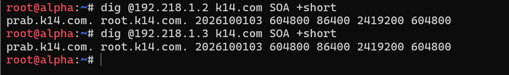

### Soal 7 - Satrio
> abbey dan penny sebagai gerbang utama, obladi dan desmond sebagai web statis, oblada dan molly sebagai web dinamis. Tambahkan pada zona `<xxxx>.com` A record untuk `vault.<xxxx>.com` (IP obladi & desmond), dan `core.<xxxx>.com` (IP oblada & molly). Tetapkan CNAME: `www.<xxxx>.com` mengarah ke `penny.<xxxx>.com`, `static.<xxxx>.com` mengarah ke `abbey.<xxxx>.com`. Verifikasi dari dua klien berbeda bahwa seluruh hostname tersebut ter-resolve ke tujuan yang benar dan konsisten.

Penyelesaian soal ini dilakukan dengan menambahkan *record* DNS baru pada *file* zona `db.k14` di DNS Master (node `prab`). Saya menggunakan metode DNS *Round-Robin* dengan mendeklarasikan nama domain yang sama (`vault` dan `core`) ke lebih dari satu *A record* (IP yang berbeda). Selain itu, ditambahkan pula *CNAME record* untuk alias `www` dan `static`. Nilai serial SOA dinaikkan kembali (menjadi `2026100103`) agar node `tedd` mensinkronkan perubahan ini.

**1. Konfigurasi Penambahan Record di Node prab**
Isi pembaruan `/etc/bind/db.k14` pada `/root/script.sh` node `prab` menjadi:

```bash
cat <<EOF> /etc/bind/db.k14
\$TTL    604800
@       IN      SOA     prab.k14.com. root.k14.com. (
                              2026100103 ; Serial (Dinaikkan)
                              604800     ; Refresh
                              86400      ; Retry
                              2419200    ; Expire
                              604800 )   ; Negative Cache TTL
;
@       IN      NS      prab.k14.com.
@       IN      NS      tedd.k14.com.
@       IN      A       192.218.5.2

; Pengecualian prab dan tedd
prab    IN      A       192.218.1.2
tedd    IN      A       192.218.1.3

; Node Lainnya (Soal 5)
rootkit IN      A       192.218.1.1
alpha   IN      A       192.218.6.2
beta    IN      A       192.218.6.3
gamma   IN      A       192.218.6.4
delta   IN      A       192.218.7.2
epsilon IN      A       192.218.7.3
abbey   IN      A       192.218.4.2
penny   IN      A       192.218.5.2
obladi  IN      A       192.218.1.4
desmond IN      A       192.218.1.5
oblada  IN      A       192.218.1.6
molly   IN      A       192.218.1.7

; Soal 7 - A Record Multiple IP (Round-Robin)
vault   IN      A       192.218.1.4
vault   IN      A       192.218.1.5
core    IN      A       192.218.1.6
core    IN      A       192.218.1.7

; Soal 7 - CNAME Record
www     IN      CNAME   penny
static  IN      CNAME   abbey
EOF

pkill named && named
```
**2. Pembuktian dan Verifikasi**

Pengujian dilakukan menggunakan perintah `dig` dari dua node klien yang berbeda (misalnya `alpha` dan `beta`) untuk memastikan resolusi nama berjalan konsisten di seluruh jaringan.

Pembuktian dari klien pertama (`alpha`):
(Jalankan perintah `dig vault.k14.com`, `dig core.k14.com`, dan `ping -c 2 www.k14.com` dari node `alpha`)
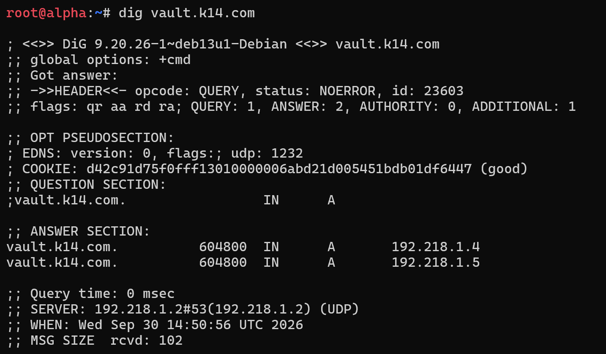 <br>
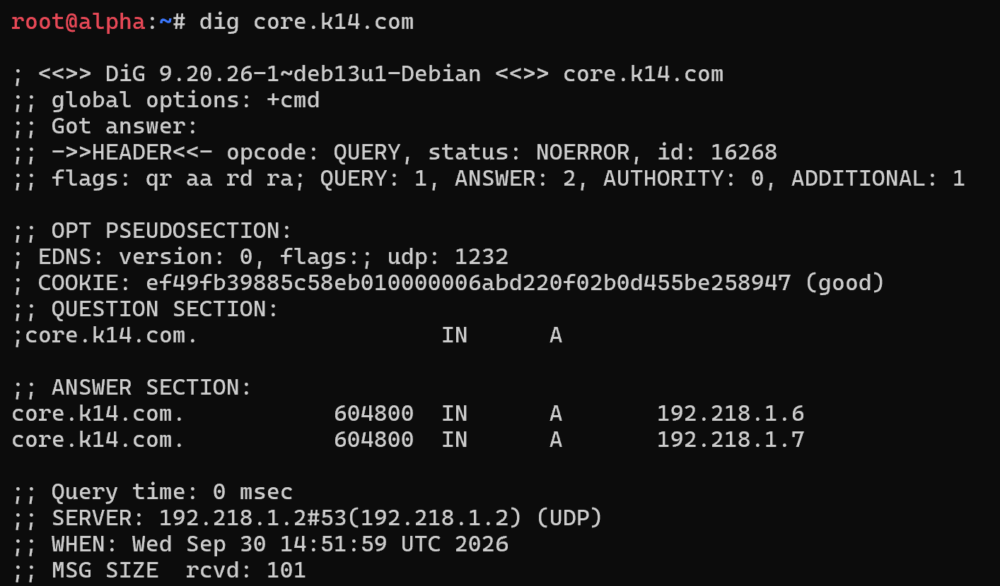 <br>
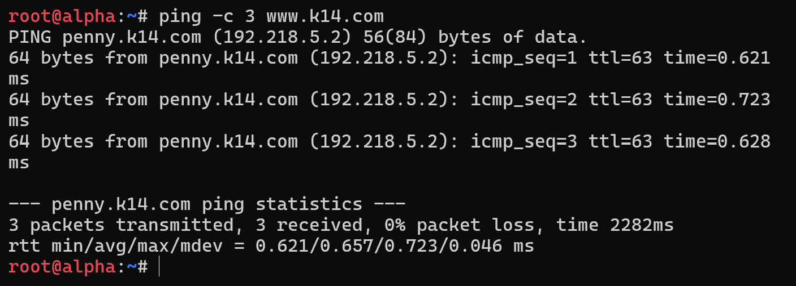 <br>

Pembuktian dari klien kedua (`beta`):
(Jalankan perintah `dig vault.k14.com`, `dig core.k14.com`, dan `ping -c 2 static.k14.com` dari node `beta`)


### Soal 8 - Satrio
> Di prab (ns1) deklarasikan reverse zone untuk segmen jaringan tempat abbey, penny, area vault, dan area core berada. Di tedd (ns2) tarik reverse zone tersebut sebagai slave, isi PTR untuk keempat hostname itu agar pencarian balik IP address mengembalikan hostname yang benar, lalu pastikan query reverse untuk alamat abbey, penny, area vault, dan area core dijawab authoritative.

Penyelesaian soal ini melibatkan pembuatan tiga Reverse Zone (`1.218.192.in-addr.arpa`, `4.218.192.in-addr.arpa`, dan `5.218.192.in-addr.arpa`) pada DNS Master (`prab`) beserta PTR *record* masing-masing. Konfigurasi ini kemudian disinkronkan ke DNS Slave (`tedd`).

**1. Konfigurasi Reverse Zone Master (Node prab)**
Menambahkan baris berikut ke dalam `/root/script.sh` pada node `prab`. Konfigurasi ini ditambahkan di bawah blok zona `k14.com` yang sudah ada:

```bash
# Deklarasi Reverse Zone di named.conf.local
cat <<EOF>> /etc/bind/named.conf.local

zone "1.218.192.in-addr.arpa" {
    type master;
    file "/etc/bind/db.1";
    allow-transfer { 192.218.1.3; };
    also-notify { 192.218.1.3; };
};

zone "4.218.192.in-addr.arpa" {
    type master;
    file "/etc/bind/db.4";
    allow-transfer { 192.218.1.3; };
    also-notify { 192.218.1.3; };
};

zone "5.218.192.in-addr.arpa" {
    type master;
    file "/etc/bind/db.5";
    allow-transfer { 192.218.1.3; };
    also-notify { 192.218.1.3; };
};
EOF

# File Reverse Zone untuk Subnet 1 (Vault & Core)
cat <<EOF> /etc/bind/db.1
\$TTL    604800
@       IN      SOA     prab.k14.com. root.k14.com. (
                              2026100101 ; Serial
                              604800     ; Refresh
                              86400      ; Retry
                              2419200    ; Expire
                              604800 )   ; Negative Cache TTL
;
@       IN      NS      prab.k14.com.
@       IN      NS      tedd.k14.com.
4       IN      PTR     vault.k14.com.
5       IN      PTR     vault.k14.com.
6       IN      PTR     core.k14.com.
7       IN      PTR     core.k14.com.
EOF

# File Reverse Zone untuk Subnet 4 (Abbey)
cat <<EOF> /etc/bind/db.4
\$TTL    604800
@       IN      SOA     prab.k14.com. root.k14.com. (
                              2026100101 ; Serial
                              604800     ; Refresh
                              86400      ; Retry
                              2419200    ; Expire
                              604800 )   ; Negative Cache TTL
;
@       IN      NS      prab.k14.com.
@       IN      NS      tedd.k14.com.
2       IN      PTR     abbey.k14.com.
EOF

# File Reverse Zone untuk Subnet 5 (Penny)
cat <<EOF> /etc/bind/db.5
\$TTL    604800
@       IN      SOA     prab.k14.com. root.k14.com. (
                              2026100101 ; Serial
                              604800     ; Refresh
                              86400      ; Retry
                              2419200    ; Expire
                              604800 )   ; Negative Cache TTL
;
@       IN      NS      prab.k14.com.
@       IN      NS      tedd.k14.com.
2       IN      PTR     penny.k14.com.
EOF

pkill named && named
```

**Konfigurasi Reverse Zone Slave (Node tedd)**

Menambahkan baris berikut ke dalam `/root/script.sh` pada node `tedd` untuk menarik konfigurasi *reverse zone* dari prab:
```bash
cat <<EOF>> /etc/bind/named.conf.local

zone "1.218.192.in-addr.arpa" {
    type slave;
    masters { 192.218.1.2; };
    file "/var/cache/bind/db.1";
};

zone "4.218.192.in-addr.arpa" {
    type slave;
    masters { 192.218.1.2; };
    file "/var/cache/bind/db.4";
};

zone "5.218.192.in-addr.arpa" {
    type slave;
    masters { 192.218.1.2; };
    file "/var/cache/bind/db.5";
};
EOF

pkill named && named
```

**3. Verifikasi DNS Reverse (PTR)**

Pembuktian dilakukan melalui klien dengan menggunakan perintah `dig -x` atau `host` pada alamat IP yang telah didaftarkan untuk membuktikan reverse zone merespons secara authoritative:


### Soal 9 - Satrio
> Jalankan layanan web statis pada hostname di node area vault (menggunakan apache). Buka folder direktori /arsip/ dan aktifkan fitur autoindex (directory listing) pada konfigurasi Nginx sehingga seluruh daftar file di dalamnya dapat ditelusuri langsung dari browser. Akses pengujian harus dilakukan melalui hostname, bukan IP address.

Penyelesaian soal ini dilakukan pada node `obladi` dan `desmond` (Area Vault) dengan menginstal web server Apache. (Catatan: Instruksi "Nginx" pada kalimat kedua diasumsikan sebagai *typo* karena kalimat pertama secara eksplisit menginstruksikan penggunaan Apache). Saya membuat direktori `/arsip/` di dalam *document root*, menambahkan beberapa file percobaan (*dummy*), dan mengaktifkan fitur *directory listing* dengan menambahkan `Options +Indexes` pada konfigurasi *VirtualHost*.

**1. Konfigurasi Web Server Statis (Node obladi & desmond)**

Script berikut dieksekusi pada `/root/script.sh` di kedua node area *vault* (`obladi` dan `desmond`):

```bash
#!/bin/bash
# Instalasi Apache2
apt-get update
apt-get install apache2 -y

# Membuat direktori /arsip/ dan file dummy untuk pengujian
mkdir -p /var/www/html/arsip
echo "Ini adalah dokumen rahasia 1" > /var/www/html/arsip/dokumen1.txt
echo "Ini adalah dokumen rahasia 2" > /var/www/html/arsip/dokumen2.txt

# Konfigurasi VirtualHost Apache untuk autoindex
cat <<EOF> /etc/apache2/sites-available/vault.conf
<VirtualHost *:80>
    ServerName vault.k14.com
    DocumentRoot /var/www/html

    <Directory /var/www/html/arsip>
        Options +Indexes
        AllowOverride None
        Require all granted
    </Directory>
</VirtualHost>
EOF

# Menonaktifkan site default, mengaktifkan site vault, dan restart apache
a2dissite 000-default.conf
a2ensite vault.conf
service apache2 restart || apache2ctl start
```

**2. Verifikasi Fitur Autoindex**

Pengujian dilakukan dari node klien (misal: `alpha`) dengan mengakses URL melalui *hostname* `vault.k14.com/arsip/` menggunakan perintah curl:
 <br>

### Soal 10 - Satrio
> Jalankan layanan web dinamis (PHP-FPM) pada hostname di node core (menggunakan nginx). Buat sebuah aplikasi sederhana yang memuat halaman beranda dan halaman profil. Terapkan aturan rewrite pada server sehingga akses ke /profil dapat berfungsi dengan URL bersih (tanpa akhiran .php). Akses pengujian wajib dilakukan melalui hostname.

Penyelesaian soal ini dilakukan pada node `oblada` dan `molly` (Area Core) dengan menginstal web server Nginx dan PHP-FPM. Saya membuat dua file PHP sederhana, yaitu `index.php` untuk halaman beranda dan `profil.php` untuk halaman profil. Agar URL bersih berfungsi untuk *path* `/profil`, saya menambahkan aturan `try_files $uri $uri/ $uri.php?$query_string;` pada blok server Nginx. Konfigurasi FastCGI diset untuk menggunakan port TCP `9000` guna menghindari konflik versi penamaan *socket* PHP-FPM.

**1. Konfigurasi Web Server Dinamis (Node oblada & molly)**
Script berikut dieksekusi pada `/root/script.sh` di kedua node area *core* (`oblada` dan `molly`):

```bash
#!/bin/bash
# Instalasi Nginx dan PHP-FPM
apt-get update
apt-get install nginx php-fpm -y

# Mengubah konfigurasi PHP-FPM agar listen di 127.0.0.1:9000 (menghindari isu versi socket)
sed -i 's/^listen = .*/listen = 127.0.0.1:9000/' /etc/php/*/fpm/pool.d/www.conf
/etc/init.d/php*-fpm start || /etc/init.d/php*-fpm restart

# Membuat halaman aplikasi sederhana
cat <<EOF> /var/www/html/index.php
<?php echo "<h1>Selamat Datang di Beranda Area Core</h1>"; ?>
EOF

cat <<EOF> /var/www/html/profil.php
<?php echo "<h1>Ini adalah Halaman Profil Area Core</h1>"; ?>
EOF

# Konfigurasi Nginx untuk core.k14.com dengan URL Bersih (Clean URL)
cat <<EOF> /etc/nginx/sites-available/core.conf
server {
    listen 80;
    server_name core.k14.com;
    root /var/www/html;
    index index.php index.html index.htm;

    # Aturan rewrite (Clean URL)
    location / {
        try_files \$uri \$uri/ \$uri.php?\$query_string;
    }

    # Handling file PHP
    location ~ \.php\$ {
        include snippets/fastcgi-php.conf;
        fastcgi_pass 127.0.0.1:9000;
    }
}
EOF

# Menonaktifkan site default, mengaktifkan site core, dan restart Nginx
rm -f /etc/nginx/sites-enabled/default
ln -s /etc/nginx/sites-available/core.conf /etc/nginx/sites-enabled/
service nginx restart || nginx -s reload
```

**2. Verifikasi Aplikasi dan URL Bersih**

Pengujian dilakukan dari node klien (misal: `alpha`) dengan mengakses URL melalui hostname menggunakan perintah `curl`


### Soal 11
> Konfigurasikan Penny (menggunakan Apache) sebagai reverse proxy dan load balancer menuju area vault (Obladi dan Desmond). Sementara itu, konfigurasikan Abbey (menggunakan Nginx) sebagai reverse proxy dan load balancer menuju area core (Oblada dan Molly).

Penyelesaian soal ini dibagi menjadi dua tahap: konfigurasi *reverse proxy* dan *load balancer* berbasis Apache pada node `penny`, serta berbasis Nginx pada node `abbey`. Node `penny` dikonfigurasi untuk mendistribusikan beban lalu lintas ke Area Vault (`obladi` dan `desmond`), sedangkan node `abbey` mendistribusikan lalu lintas ke Area Core (`oblada` dan `molly`). Kedua gerbang proxy juga disetel agar meneruskan *header* `Host` dan `X-Real-IP` ke server *backend*.

**1. Konfigurasi Reverse Proxy & Load Balancer Apache (Node penny)**
Pada node `penny`, saya menginstal Apache2 beserta modul-modul proxy (`proxy`, `proxy_http`, `proxy_balancer`, `lbmethod_byrequests`, `headers`), kemudian membuat VirtualHost untuk `www.k14.com`:

```bash
#!/bin/bash
# Instalasi Apache2 dan aktivasi modul proxy
apt-get update
apt-get install apache2 -y
a2enmod proxy proxy_http proxy_balancer lbmethod_byrequests headers

# Konfigurasi Reverse Proxy Penny
cat <<EOF> /etc/apache2/sites-available/penny_proxy.conf
<VirtualHost *:80>
    ServerName www.k14.com

    <Proxy balancer://vault_cluster>
        BalancerMember http://192.218.1.4
        BalancerMember http://192.218.1.5
    </Proxy>

    # Forwarding Header Host dan X-Real-IP
    ProxyPreserveHost On
    RequestHeader set X-Real-IP "%{REMOTE_ADDR}s"

    ProxyPass / balancer://vault_cluster/
    ProxyPassReverse / balancer://vault_cluster/
</VirtualHost>
EOF

# Terapkan konfigurasi
a2dissite 000-default.conf
a2ensite penny_proxy.conf
service apache2 restart || apache2ctl start
```

**2. Konfigurasi Reverse Proxy & Load Balancer Nginx (Node abbey)**
Pada node `abbey`, saya mengonfigurasi Nginx dengan mendefinisikan *upstream cluster* menuju Area Core (`192.218.1.6` dan `192.218.1.7`) serta meneruskan header `Host` dan `X-Real-IP`:

```bash
#!/bin/bash
cat <<EOF> /etc/nginx/sites-available/abbey_proxy.conf
upstream core_cluster {
    server 192.218.1.6;
    server 192.218.1.7;
}

server {
    listen 80;
    server_name static.k14.com;

    location / {
        proxy_pass http://core_cluster;
        proxy_set_header Host \$host;
        proxy_set_header X-Real-IP \$remote_addr;
    }
}
EOF

# Membuat symlink dan restart Nginx
rm -f /etc/nginx/sites-enabled/default
ln -s /etc/nginx/sites-available/abbey_proxy.conf /etc/nginx/sites-enabled/
service nginx restart || nginx -s reload
```

**3. Pembuktian dan Verifikasi**
Pengujian dilakukan dari node klien (misal: `alpha`) dengan mengakses URL kedua gerbang *reverse proxy* menggunakan perintah `curl`:
- Mengakses domain `www.k14.com` (path `/arsip/`) untuk memverifikasi *reverse proxy* dan *load balancing* ke Area Vault (`obladi` dan `desmond`):
```bash
curl http://www.k14.com/arsip/
```
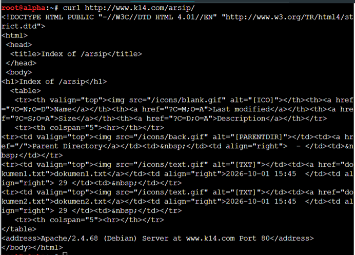

- Mengakses domain `static.k14.com` untuk memverifikasi *reverse proxy* dan *load balancing* ke Area Core (`oblada` dan `molly`):
```bash
curl http://static.k14.com/
```
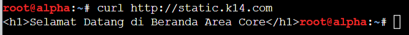

### Soal 12 - Bastian
> Terdapat ruang khusus di penny yang menyimpan dokumen rahasia sindikat, oleh karena itu terapkan perlindungan basic authentication untuk path /admin. Akses ke jalur tersebut harus menolak pengunjung tanpa kredensial, dan hanya mengizinkan masuk jika menggunakan credential berikut: username: prabs | password: pakar_pinter_jadi_gob***

Penyelesaian soal ini dilakukan pada node `penny` dengan menerapkan autentikasi dasar (*Basic Authentication*) pada direktori lokal `/admin`. Karena node `penny` berfungsi sebagai *reverse proxy*, dibuat direktif pengecualian (`ProxyPass /admin !`) agar permintaan ke *path* tersebut dilayani langsung oleh server Apache lokal di `penny` dan tidak diteruskan ke *cluster* backend. Kredensial pengguna dibuat menggunakan utilitas `htpasswd`.

**1. Konfigurasi Basic Authentication (Node penny)**
Script berikut dieksekusi pada node `penny` untuk membuat akun autentikasi, direktori rahasia, serta memperbarui VirtualHost `www.k14.com`:

```bash
#!/bin/bash
# Instalasi tools dan pembuatan kredensial
apt-get update
apt-get install apache2-utils -y
mkdir -p /var/www/admin
echo "<h1>Ruang Rahasia Sindikat</h1>" > /var/www/admin/index.html
htpasswd -bc /etc/apache2/.htpasswd prabs pakar_pinter_jadi_gob***

# Menambahkan blok konfigurasi berikut di dalam VirtualHost www.k14.com (penny_proxy.conf):
ProxyPass /admin !
Alias /admin /var/www/admin
<Directory /var/www/admin>
    AuthType Basic
    AuthName "Restricted Area"
    AuthUserFile /etc/apache2/.htpasswd
    Require valid-user
</Directory>

service apache2 restart || apache2ctl restart
```

**2. Pembuktian dan Verifikasi**
Pengujian dilakukan dari node klien (misal: `alpha`) dengan dua skenario pengujian:
- Menguji akses tanpa kredensial untuk memastikan server menolak permintaan dengan kode status `401 Unauthorized`:
```bash
curl -I http://penny.k14.com/admin
```
- Menguji akses dengan kredensial yang valid (`prabs:pakar_pinter_jadi_gob***`) untuk memastikan halaman rahasia dapat diakses:
```bash
curl -u prabs:pakar_pinter_jadi_gob*** http://www.k14.com/admin/
```
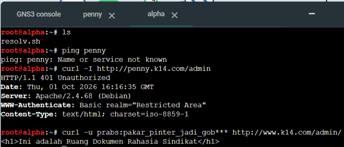

### Soal 13 - Bastian
> Terapkan aturan redirect pada kedua gerbang agar pengunjung selalu diarahkan ke nama domain kanonik (utama) mereka. Jika penny diakses melalui IP atau domain penny.k14.com, pengunjung akan dialihkan secara permanen (301) ke www.k14.com. Sementara itu, jika abbey diakses melalui IP atau domain abbey.k14.com, pengunjung akan dialihkan sementara (302) ke static.k14.com.

Penyelesaian soal ini dilakukan dengan menambahkan konfigurasi pengalihan (*redirect*) pada masing-masing gerbang proxy agar seluruh akses non-kanonik (baik melalui alamat IP langsung maupun domain sekunder) dialihkan ke nama domain utama. Pada node `penny` (Apache), diterapkan *Redirect 301 (Moved Permanently)* menuju `http://www.k14.com/`. Sedangkan pada node `abbey` (Nginx), diterapkan *Redirect 302 (Found / Moved Temporarily)* menuju `http://static.k14.com/`.

**1. Konfigurasi Redirect 301 di Apache (Node penny)**
Pada node `penny`, saya menambahkan blok VirtualHost pengalihan pada berkas konfigurasi `/etc/apache2/sites-available/penny_proxy.conf`:

```bash
<VirtualHost *:80>
    ServerName penny.k14.com
    ServerAlias 192.218.5.2
    Redirect 301 / http://www.k14.com/
</VirtualHost>
```

**2. Konfigurasi Redirect 302 di Nginx (Node abbey)**
Pada node `abbey`, saya menambahkan blok server pengalihan pada berkas konfigurasi `/etc/nginx/sites-available/abbey_proxy.conf`:

```bash
server {
    listen 80;
    server_name abbey.k14.com 192.218.4.2;
    return 302 http://static.k14.com\$request_uri;
}
```

Setelah memperbarui berkas konfigurasi, saya me-restart layanan web server pada masing-masing node (`service apache2 restart` pada `penny` dan `service nginx restart` pada `abbey`).

**3. Pembuktian dan Verifikasi**
Pengujian dilakukan dari node klien (misal: `alpha`) dengan memeriksa header respons HTTP menggunakan `curl -I`:
- Memverifikasi pengalihan permanen (HTTP 301) pada node `penny`:
```bash
curl -I http://penny.k14.com
```
(Memastikan respons mengembalikan status `HTTP/1.1 301 Moved Permanently` dengan header `Location: http://www.k14.com/`)

- Memverifikasi pengalihan sementara (HTTP 302) pada node `abbey`:
```bash
curl -I http://abbey.k14.com
```
(Memastikan respons mengembalikan status `HTTP/1.1 302 Moved Temporarily` dengan header `Location: http://static.k14.com/`)

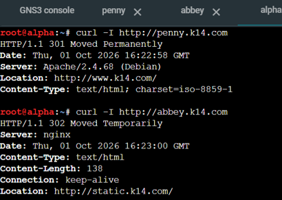

### Soal 14 - Bastian
> Konfigurasikan server backend (Area Vault dan Area Core) agar membaca dan mencatat header X-Real-IP yang dikirimkan oleh reverse proxy, sehingga IP asli pengunjung tercatat di dalam access log, bukan IP dari reverse proxy.

Penyelesaian soal ini dilakukan pada seluruh server backend (Area Vault dan Area Core) agar berkas *access log* mencatat alamat IP asli milik pengunjung (`X-Real-IP`), bukan alamat IP dari gerbang *reverse proxy*. Pada Apache di Area Vault (`obladi` dan `desmond`), format log utama diubah dari `%h` menjadi `%a`. Pada Nginx di Area Core (`oblada` dan `molly`), modul `real_ip` dikonfigurasi untuk mempercayai alamat IP gerbang `abbey` (`192.218.4.2`).

**1. Konfigurasi Pencatatan IP Klien pada Apache (Node obladi & desmond)**
Script berikut dieksekusi pada kedua node area Vault (`obladi` dan `desmond`) untuk memodifikasi format log pada `/etc/apache2/apache2.conf`:

```bash
#!/bin/bash
# Memodifikasi format log utama agar mencatat client IP (%a)
sed -i 's/%v:%p %h/%v:%p %a/g' /etc/apache2/apache2.conf
service apache2 restart || apache2ctl restart
```

**2. Konfigurasi Real-IP pada Nginx (Node oblada & molly)**
Script berikut dieksekusi pada kedua node area Core (`oblada` dan `molly`) untuk menerima header `X-Real-IP` dari node `abbey` (`192.218.4.2`):

```bash
#!/bin/bash
# Menambahkan konfigurasi real_ip
cat <<EOF> /etc/nginx/conf.d/realip.conf
set_real_ip_from 192.218.4.2;
real_ip_header X-Real-IP;
EOF

service nginx restart || nginx -s reload
```

**3. Pembuktian dan Verifikasi**
Pengujian dilakukan dengan mengirimkan permintaan HTTP dari node klien (misal: `alpha`, IP `192.218.6.2`) menuju kedua gerbang:
```bash
curl http://www.k14.com/arsip/
curl http://static.k14.com/
```
Kemudian, berkas log akses diperiksa langsung pada server *backend*:
- Pada node `obladi` (Area Vault):
```bash
tail -n 5 /var/log/apache2/other_vhosts_access.log
```
- Pada node `oblada` (Area Core):
```bash
tail -n 5 /var/log/nginx/access.log
```
Hasil verifikasi menunjukkan bahwa alamat IP yang tercatat di dalam log adalah IP asli milik klien `alpha` (`192.218.6.2`), bukan IP dari gerbang *reverse proxy* (`192.218.5.2` atau `192.218.4.2`).

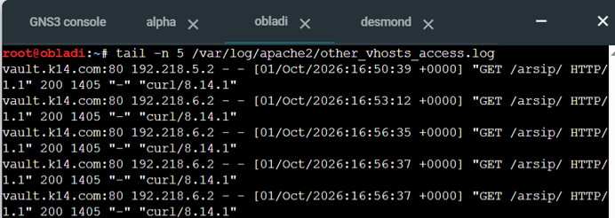

### Soal 15 - Bastian
> Buatlah jalur khusus yang disajikan secara lokal di masing-masing gerbang proxy. Pada node penny, buat path /eternal untuk melayani halaman dari /var/www/eternal yang mendukung eksekusi PHP. Pada node abbey, buat path /orion untuk melayani halaman dari /var/www/orion yang bersifat murni statis tanpa fungsi rendering PHP.

Penyelesaian soal ini dilakukan dengan menyediakan jalur direktori lokal khusus pada masing-masing gerbang proxy yang berdiri sendiri dan dikecualikan dari penerusan *load balancer*. Pada node `penny` (Apache), dibuat *path* `/eternal` yang menyajikan berkas PHP dari direktori `/var/www/eternal` dengan modul `libapache2-mod-php`. Pada node `abbey` (Nginx), dibuat *path* `/orion` yang menyajikan konten statis dari direktori `/var/www/orion` secara langsung tanpa pemrosesan PHP.

**1. Konfigurasi Jalur Dinamis /eternal di Apache (Node penny)**
Pada node `penny`, saya menginstal modul PHP, menyiapkan direktori serta file uji `index.php`, dan menambahkan pengecualian proxy (`ProxyPass /eternal !`) pada VirtualHost:

```bash
#!/bin/bash
# Instalasi modul PHP dan persiapan direktori lokal
apt-get update
apt-get install php libapache2-mod-php -y
mkdir -p /var/www/eternal
echo "<?php echo '<h1>Render PHP di Eternal Berhasil!</h1>'; ?>" > /var/www/eternal/index.php

# Menambahkan blok konfigurasi ke dalam VirtualHost www.k14.com (penny_proxy.conf):
ProxyPass /eternal !
Alias /eternal /var/www/eternal
<Directory /var/www/eternal>
    Require all granted
</Directory>

service apache2 restart || apache2ctl restart
```

**2. Konfigurasi Jalur Statis /orion di Nginx (Node abbey)**
Pada node `abbey`, saya menyiapkan direktori serta file uji statis `index.html`, kemudian menambahkan blok `location /orion/` pada konfigurasi server `static.k14.com`:

```bash
#!/bin/bash
# Persiapan direktori statis
mkdir -p /var/www/orion
echo "<h1>Halaman Statis Orion</h1>" > /var/www/orion/index.html

# Menambahkan blok location /orion/ pada /etc/nginx/sites-available/abbey_proxy.conf:
location /orion/ {
    alias /var/www/orion/;
    index index.html;
}

service nginx restart || nginx -s reload
```

**3. Pembuktian dan Verifikasi**
Pengujian dilakukan dari node klien (misal: `alpha`) dengan mengakses kedua *path* khusus tersebut menggunakan perintah `curl`:
- Memverifikasi eksekusi PHP pada path `/eternal/` di node `penny`:
```bash
curl http://www.k14.com/eternal/
```
(Memastikan respons mengembalikan output hasil eksekusi kode PHP)

- Memverifikasi sajian halaman statis pada path `/orion/` di node `abbey`:
```bash
curl http://static.k14.com/orion/
```
(Memastikan respons mengembalikan dokumen statis HTML murni)

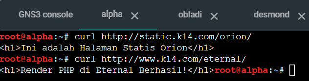
